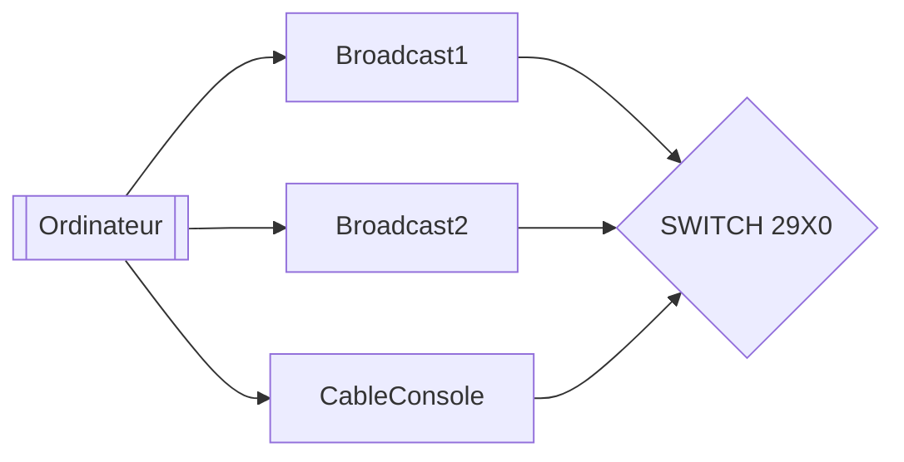
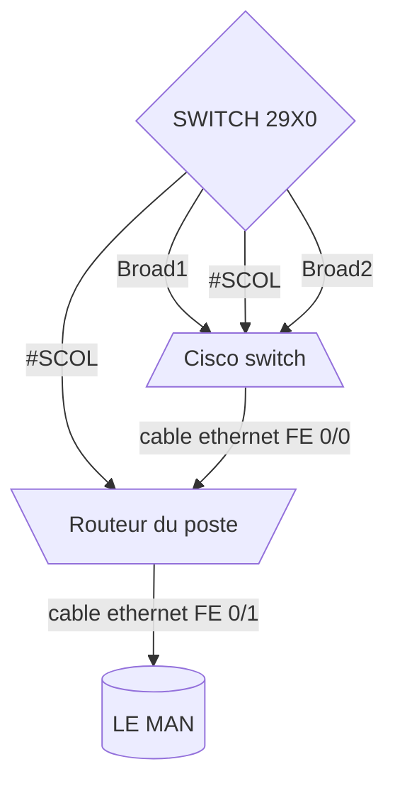

# ROUTAGE /VLAN/SCOL/FILTRAGE ACL


README

Lycée Mongez

Objectif : déployer un routage sur le man 


### Cablage ......................................................#

### Routage ......................................................#

### PuTTY configuration ..........................................#

### PuTTY config switch ..........................................#

### PuTTy config routeur .........................................#

### Filtrage / ACL ...............................................#

/Pagebreak


## Cablage

Commencant par brancher les cables nécessaire:
* 2 cables Ethernet (pour le Scol et Admin)
* 1 cable console (pour configurer le routeur/switch)




*Faut bien identifier votre numéros de port*

## Routage
Suivez ces étapes:
1. Branche un cable d'ethernet(Broad1/Admin) au port de cisco switch
2. Branche un cable d'ethernet(Broad2/Scol) au port de cisco switch
3. **Remettre les configuration du switch a zéro en appuyant le bouton 'mode' pour 10 secondes**





Utiliser Putty.


## PuTTY config switch

**Suivez ses intrustions sans faute**

_Pour sauvegarder votre status de configuration , tapez 'EN'  puis 'copy runing-config startup-config' 'reload'_


[switch.txt](https://github.com/Pyncro/sisr-routage-vlan-filtrage/blob/main/switch.txt)


```
EN 

Conf t 

Interface FastEthernet 0/1 

Switchport mode access  

Switchport acc VLAN 16 

Exit

INT FastEthernet 0/2 

Switchport mode access 

Switchport acc VLAN 116 

Exit

INT F0/3 

Switchport mode trunk

```


## PuTTy config routeur

**Remettez votre routeur a zéro avant de l'utiliser**
1.  Brancher la cable console dans le port console du routeur
2.  Sur Putty : `write erase`
3.  `reload`


[routeur.txt](https://github.com/Pyncro/sisr-routage-vlan-filtrage/blob/main/routeur.txt)


```
EN

Conf t 

Interface FastEthernet 0/0.16
no ip proxy-arp
ENCAPSULATION DOT1Q 16

IP address 172.26.16.1 255.255.255.0 

Int FastEthernet0/0.116
no ip proxy-arp
encapsulation DOT1Q 116 

IP address 172.27.16.1 255.255.255.0  

EXIT 

ip route 0.0.0.0 0.0.0.0 172.30.0.40 


ip route 172.26.1.0 255.255.255.0 172.30.0.1
ip route 172.26.2.0 255.255.255.0 172.30.0.2
ip route 172.26.3.0 255.255.255.0 172.30.0.3
ip route 172.26.4.0 255.255.255.0 172.30.0.4
ip route 172.26.5.0 255.255.255.0 172.30.0.5
ip route 172.26.6.0 255.255.255.0 172.30.0.6
ip route 172.26.7.0 255.255.255.0 172.30.0.7
ip route 172.26.8.0 255.255.255.0 172.30.0.8
ip route 172.26.9.0 255.255.255.0 172.30.0.9
ip route 172.26.10.0 255.255.255.0 172.30.0.10
ip route 172.26.11.0 255.255.255.0 172.30.0.11
ip route 172.26.12.0 255.255.255.0 172.30.0.12
ip route 172.26.13.0 255.255.255.0 172.30.0.13
ip route 172.26.14.0 255.255.255.0 172.30.0.14
ip route 172.26.15.0 255.255.255.0 172.30.0.15

ip route 172.26.17.0 255.255.255.0 172.30.0.17


ip route 172.27.1.0 255.255.255.0 172.30.0.1
ip route 172.27.2.0 255.255.255.0 172.30.0.2
ip route 172.27.3.0 255.255.255.0 172.30.0.3
ip route 172.27.4.0 255.255.255.0 172.30.0.4
ip route 172.27.5.0 255.255.255.0 172.30.0.5
ip route 172.27.6.0 255.255.255.0 172.30.0.6
ip route 172.27.7.0 255.255.255.0 172.30.0.7
ip route 172.27.8.0 255.255.255.0 172.30.0.8
ip route 172.27.9.0 255.255.255.0 172.30.0.9
ip route 172.27.10.0 255.255.255.0 172.30.0.10
ip route 172.27.11.0 255.255.255.0 172.30.0.11
ip route 172.27.12.0 255.255.255.0 172.30.0.12
ip route 172.27.13.0 255.255.255.0 172.30.0.13
ip route 172.27.14.0 255.255.255.0 172.30.0.14
ip route 172.27.15.0 255.255.255.0 172.30.0.15

ip route 172.27.17.0 255.255.255.0 172.30.0.17

```


## Filtrage / ACL 


[acl.txt](https://github.com/Pyncro/sisr-routage-vlan-filtrage/blob/main/acl.txt)


```
en 
conf t
ip access-list extended 100
permit icmp any any
permit icmp any any echo-reply
permit tcp any eq 22 any
permit tcp any eq 80 any
permit tcp any eq 443 any
permit udp any eq 53 any
permit udp any eq 853 any
permit udp 172.30.1.25 0.0.255.255 eq 465 any
permit tcp 172.30.1.25 0.0.255.255 eq 995 any
permit tcp 172.30.1.25 0.0.255.255 eq 993 any
deny ip any any
exit


en
conf t
ip access-list extended outacl
permit icmp any any
permit udp any any eq 53
permit udp any any eq 853
permit tcp any any eq 80
permit tcp any any eq 443
permit udp 172.30.1.25 0.0.255.255 any eq 465 
permit tcp 172.30.1.25 0.0.255.255 any eq 995 
permit tcp 172.30.1.25 0.0.255.255 any eq 993 
deny ip any any
exit
interface FastEthernet 0/1
ip access-group 100 in
ip access-group out100 out
exit

```

